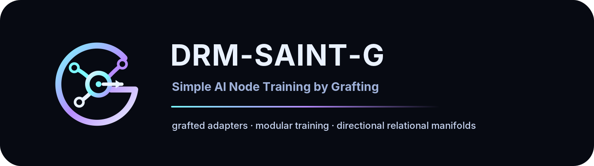

# DRM-SAINT-G

<p align="center">
  
</p>

<p align="center">
  <a href="COPYRIGHT"></a>
  <a href="https://python.org"></a>
  <a href="pyproject.toml"></a>
  <a href="#architecture"></a>
  <a href="#core-idea"></a>
  <a href="https://github.com/gnai-creator/drm_transformer"></a>
  <a href="docs/roadmap.md"></a>
  <a href="#scalability"></a>
</p>

<p align="center">
  <strong>Simple AI Node Training for DRM growth by grafting</strong>
</p>

<p align="center">
  <a href="docs/roadmap.md">Roadmap</a> |
  <a href="docs/process/">Process Docs</a> |
  <a href="CONTRIBUTING.md">Contributing</a> |
  <a href="SECURITY.md">Security</a>
</p>

DRM-SAINT-G is an experimental runtime for growing and adapting neural models
with compact, routed, recomposable grafts.

The project asks a direct research question:

```text
Can a model gain useful new capacity without retraining every weight?
```

Instead of treating large-scale training as an all-or-nothing operation,
DRM-SAINT-G explores progressive growth:

```text
small DRM backbone
  -> route useful growth points
  -> train compact grafts
  -> validate gain
  -> consolidate only what works
```

The first target backbone is
[`drm_transformer`](https://github.com/gnai-creator/drm_transformer), a custom
geometric Transformer based on Directional Relational Manifolds.

---

## Index

- [Why This Exists](#why-this-exists)
- [Core Idea](#core-idea)
- [DRM-SAINT-G vs Traditional Training](#drm-saint-g-vs-traditional-training)
- [Architecture](#architecture)
- [Current Research Stage](#current-research-stage)
- [Quick Start](#quick-start)
- [DRM Transformer Bridge](#drm-transformer-bridge)
- [Scalability](#scalability)
- [What This Does Not Claim](#what-this-does-not-claim)
- [Roadmap](#roadmap)
- [License](#license)

---

## Why This Exists

Training a large model from scratch is expensive because the standard paradigm
updates the whole parameter space, stores optimizer state for huge tensors, and
requires massive compute even when only part of the behavior needs to change.

DRM-SAINT-G investigates a different path:

```text
freeze most of the model
train small structured growth modules
measure whether each module is worth keeping
```

This is not just fine-tuning. The long-term goal is controlled model growth:

- add capacity in specific layers;
- keep checkpoints compact;
- avoid dense optimizer state where possible;
- support merge and resume;
- compare every gain against dense baselines;
- scale from one GPU to GPU clusters.

## Core Idea

The current strongest family is Phi grafting:

```text
Delta W = A Phi B
```

Where:

- `W` is a frozen target matrix;
- `A` projects into the graft space;
- `Phi` is the compact trainable core;
- `B` projects back to the target matrix;
- `Delta W` is applied by hook, sparse update, or permanent consolidation.

This lets the system train a small relational operator instead of a dense matrix.

Variants explored so far include:

- dense Phi;
- diagonal Phi;
- upper triangular Phi;
- Hadamard Phi;
- low-rank Phi;
- least-squares initialized Phi;
- Phi with sparse residual;
- trainable `A/B` under a parameter cap;
- multi-stage Phi grafts.

## DRM-SAINT-G vs Traditional Training

| Component | Traditional full training | LoRA/QLoRA | DRM-SAINT-G |
|---|---|---|---|
| Base weights | updated | frozen or quantized | frozen by default |
| Trainable object | full matrix | low-rank adapter | routed graft |
| Delta shape | dense | low-rank | structured `A Phi B` |
| Selection | all layers or manual | target modules | sensitivity/routing/validation |
| Checkpoint | full or adapter | adapter | recomposable graft artifact |
| Growth | fixed architecture | adaptation | progressive grafting |
| Main metric | final loss | final loss per adapter | validation gain per parameter/byte/time |

DRM-SAINT-G does not replace LoRA by assumption. LoRA remains a required
baseline. The project only advances when DRM-SAINT-G wins on at least one
relevant axis: memory, checkpoint size, gain per parameter, controllable growth,
or quality under tight budgets.

## Architecture

```text
          dataset / validation batch
                    |
                    v
          +--------------------+
          | sensitivity maps   |
          +--------------------+
                    |
                    v
          +--------------------+
          | graft router       |
          +--------------------+
                    |
                    v
  frozen DRM ---- target matrix/block ---- candidate grafts
                    |
                    v
          +--------------------+
          | train A Phi B      |
          +--------------------+
                    |
                    v
          +--------------------+
          | validate gain      |
          +--------------------+
                    |
        approve / reject / defer
                    |
                    v
          +--------------------+
          | checkpoint graft   |
          +--------------------+
                    |
                    v
          +--------------------+
          | merge/consolidate  |
          +--------------------+
```

Main modules:

```text
saint/
  adapters/       DRM, Hugging Face, graft application
  blocks/         block partitioning and reconstruction
  checkpoints/    compact/sharded payloads and checksums
  codebook/       block dictionaries and reuse
  memory/         memory estimation and dtype planning
  routing/        budget, sensitivity, validation rerank
  sensitivity/    gradient, Fisher, activation and proxy maps
  training/       toy tasks, linear tasks, mini-transformer tasks
  cli/            runtime commands
```

## Current Research Stage

Completed or partially completed tracks:

- traditional LLM training paradigm documentation;
- block-codebook reconstruction;
- routed sparse delta training;
- linear-layer learning benchmarks;
- mini-transformer experiments;
- sensitivity maps;
- robust and scalable checkpoint formats;
- Hugging Face small-model bridge;
- 3B and 14B partial adaptation probes;
- DRM-G progressive grafting;
- Phi graft variants;
- final DRM-G report with a cautious recommendation to advance.

Current bridge:

```text
DRM full 125M/350M
vs
DRM 5M + DRM-SAINT-G grafted
vs
GPT-2/OPT size-band calibration
```

The goal is not to pretend that a 5M model magically becomes a full 350M model.
The goal is to measure whether growth by grafting can approach useful behavior
with better memory, checkpoint, or parameter efficiency.

## Quick Start

Create an environment:

```powershell
python -m venv .venv
.\.venv\Scripts\Activate.ps1
pip install -r requirements.txt
```

Run the CLI:

```powershell
python -m saint.cli --help
```

Run tests:

```powershell
python -m pytest
```

Inspect a small runtime command:

```powershell
python -m saint.cli estimate --help
```

## DRM Transformer Bridge

The current full-model comparison uses real `drm_transformer` scaling configs:

```text
configs/scaling/multilingual/125m.yaml
configs/scaling/multilingual/350m.yaml
```

Prepare the 350M dataset once:

```powershell
python scripts/prepare_multilingual_data.py `
  --output-dir data/multilingual_350m `
  --max-tokens 7000000000 `
  --vocab-size 50000 `
  --langs en,pt,es,fr,de
```

Finalize and clean raw shards:

```powershell
python scripts/prepare_multilingual_data.py `
  --output-dir data/multilingual_350m `
  --vocab-size 50000 `
  --finalize --clean-raw
```

Derive the 125M dataset from the 350M shard set:

```powershell
python scripts/prepare_multilingual_data.py `
  --derive-subset-from data/multilingual_350m `
  --output-dir data/multilingual_125m `
  --max-tokens 3500000000 `
  --subset-copy-mode hardlink
```

Smoke test the full 125M DRM:

```powershell
python scripts/train_distributed.py `
  --config configs/scaling/multilingual/125m.yaml `
  --device cuda `
  --override batch_size=1 gradient_accumulation_steps=8 total_tokens=819200 save_interval=100 eval_interval=100 log_interval=10 save_dir=checkpoints/multilingual_125m/smoke_100
```

## Scalability

DRM-SAINT-G is designed to scale in two different ways.

### Single GPU

On a consumer GPU, the priority is controlled memory:

- frozen base model;
- micro-batch 1;
- sparse or compact deltas;
- checkpoint payloads that avoid dense materialization;
- routed training instead of full updates;
- cheap validation before expensive consolidation.

### GPU Cluster

On a cluster, the opportunity is not only bigger batch size. It is parallel
search:

- GPU 1 tests graft candidates for layer A;
- GPU 2 tests graft candidates for layer B;
- GPU 3 runs LoRA/dense controls;
- GPU 4 validates old examples for regression;
- a coordinator approves, rejects, or defers grafts.

This resembles large-lab workflows, but with a different unit of work:

```text
not "one huge dense training job"
but "many measured growth candidates"
```

Cluster roadmap:

- DDP/FSDP for full DRM baselines;
- sharded checkpoints and optimizer payloads;
- distributed candidate queues;
- validation-gain-per-GPU-hour as a metric;
- conflict detection between approved grafts;
- staged consolidation.

## What This Does Not Claim

DRM-SAINT-G does not currently claim:

- full 70B pretraining on a consumer GPU;
- universal superiority over LoRA/QLoRA;
- replacement for dense pretraining;
- final scientific proof that grafting beats full training.

The honest claim is narrower:

```text
DRM-SAINT-G is a research system for testing whether structured grafts can add
useful capacity more efficiently than dense updates under tight budgets.
```

## Roadmap

Near-term:

1. Finish DRM full 125M smoke.
2. Run short full 125M baseline.
3. Compare DRM-SAINT-G grafted 5M against full 125M.
4. Try full 350M if memory and time allow.
5. Compare size-band perplexity against GPT-2/OPT.
6. Decide whether the 70B phase is justified.

Long-term:

- 70B partial adaptation with quantized/frozen base;
- cluster-scale graft search;
- stronger Phi families;
- better validation routing;
- compact binary graft checkpoints;
- publication-quality reports.

Full roadmap:

```text
docs/roadmap.md
docs/process/
```

## License

See:

- `LICENSE`
- `COPYRIGHT`
- `CLA.md`
- `CONTRIBUTING.md`
- `SECURITY.md`
- `PRIOR_ART.md`
